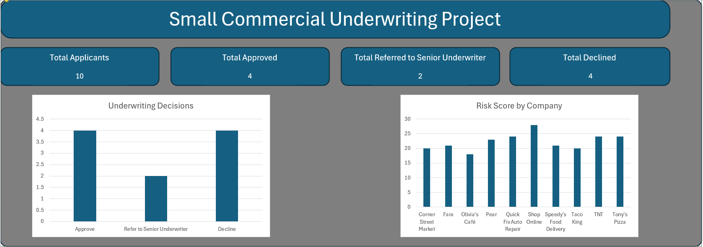
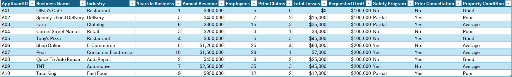
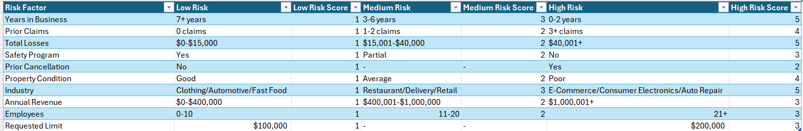
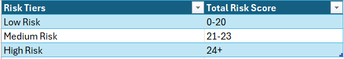
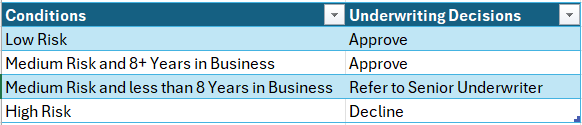
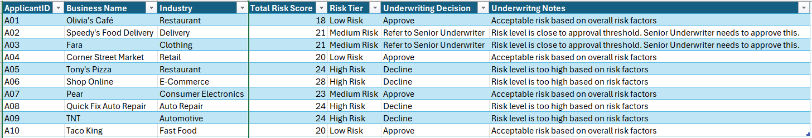
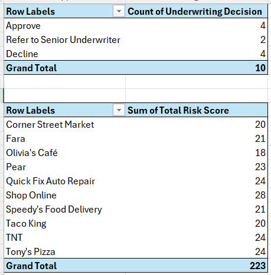

# Small Commercial Underwriting Project

## Project Overview

This project is an Excel-based underwriting risk review model designed to evaluate small business applicants for commercial insurance. The model reviews applicant characteristics such as industry, years in business, annual revenue, number of employees, number of prior claims, total losses, requested insurance limit, safety controls, prior cancellation history, and property condition.

The purpose of this project is to simulate the type of work that an underwriter may perform, including reviewing risk factors, assigning a risk score, classifying applicants by risk score, and making an underwriting decision.

This project was built to demonstrate practical skills relevant to underwriting, underwriting analyst, insurance operations, and risk analyst roles.

## Dashboard Preview

---

## Main Question for Each Applicant

The main question this project is answering for each applicant is:

**Based on the applicant's risk characteristics and overall risk level, should the applicant be approved, declined, or referred to a senior underwriter?**

---

## Skills Demonstrated

This project demonstrates:

- Dashboard creation
- Underwriting risk assessment
- Guideline-based decision-making
- Risk scoring logic
- Exposure analysis
- Claims and loss history review
- Referral and decline logic
- Excel formulas such as IFS(), OR(), AND(), SUM(), and nested functions
- PivotTables
- Business judgment and written explanation

---

## Workbook Structure

The Excel workbook contains the following sheets:

### 1. Applicants

This sheet contains the applicant data used in the underwriting review.

Key fields include:

- Applicant ID
- Business name
- Industry
- Years in business
- Annual revenue
- Number of employees
- Prior claims
- Total losses
- Requested insurance limit
- Safety program status
- Prior cancellation history
- Property condition

### 2. Guidelines

This sheet contains the simplified underwriting guidelines used to classify each risk factor as low, medium, or high risk.

The guideline categories include:

- Industry hazard
- Years in business
- Prior claims
- Total losses
- Annual revenue
- Number of employees
- Requested limit
- Safety program
- Prior cancellation
- Property condition

The Guidelines sheet also contains the total risk score cutoffs for Low Risk, Medium Risk, and High Risk classification:

- Low Risk: 0-20 points
- Medium Risk: 21-23 points
- High Risk: 24+ points

The Guidelines sheet also includes the underwriting decision logic:

- Low Risk: Approve
- Medium Risk and 8+ Years in Business: Approve
- Medium Risk and less than 8 Years in Business: Refer to a senior underwriter
- High Risk: Decline

### 3. Underwriting Review

This sheet applies scoring logic to each applicant.

Each applicant receives scores for:

- Industry risk
- Experience risk
- Claims frequency
- Loss severity
- Revenue exposure
- Employee exposure
- Requested limit exposure
- Safety controls
- Prior cancellation
- Property condition

The scores are then combined into a total risk score.

Based on the total score, the model assigns:

- Risk tier
- Underwriting decision
- Underwriter notes

### 4. Dashboard

This sheet summarizes the underwriting review results.

The dashboard includes:

- Total applicants reviewed
- Number of approved accounts
- Number of accounts referred to a senior underwriter
- Number of declined accounts
- Underwriting decision bar chart
- Risk score by company

The dashboard visuals are supported by PivotTables that summarize the underwriting decision counts and total risk scores by company.

---

## Underwriting Decision Logic

The model uses a simplified scoring system where higher scores represent higher underwriting concern.

The main decision outcomes are:

### Approve

The applicant fits underwriting guidelines and does not present major risk concerns.

### Refer to a Senior Underwriter

The applicant has risk very close to the threshold needed for easy approval. A senior underwriter is in a better position to evaluate whether the applicant should be approved due to their higher level of experience and judgment.

### Decline

The applicant has a risk level beyond the threshold the company is willing to insure.

---

## Files Included

- `Small_Commercial_Underwriting_Project.xlsx` - Main Excel workbook
- `Underwriting_Screenshots/underwriting_dashboard.png` - Dashboard preview
- `Underwriting_Screenshots/underwriting_applicant_data.png` - Applicant input data
- `Underwriting_Screenshots/underwriting_guidelines.png` - Scoring guidelines
- `Underwriting_Screenshots/underwriting_risk_tiers.png` - Risk tier classification rules
- `Underwriting_Screenshots/underwriting_decision_rules.png` - Underwriting decision rules
- `Underwriting_Screenshots/underwriting_decision_output.png` - Applicant-level risk scores and decisions
- `Underwriting_Screenshots/underwriting_pivot_tables.png` - PivotTables used for dashboard visuals

---

## Note

The data in this project is sample data created for practice and portfolio purposes. It does not include real company, customer, applicant, or policy information.
